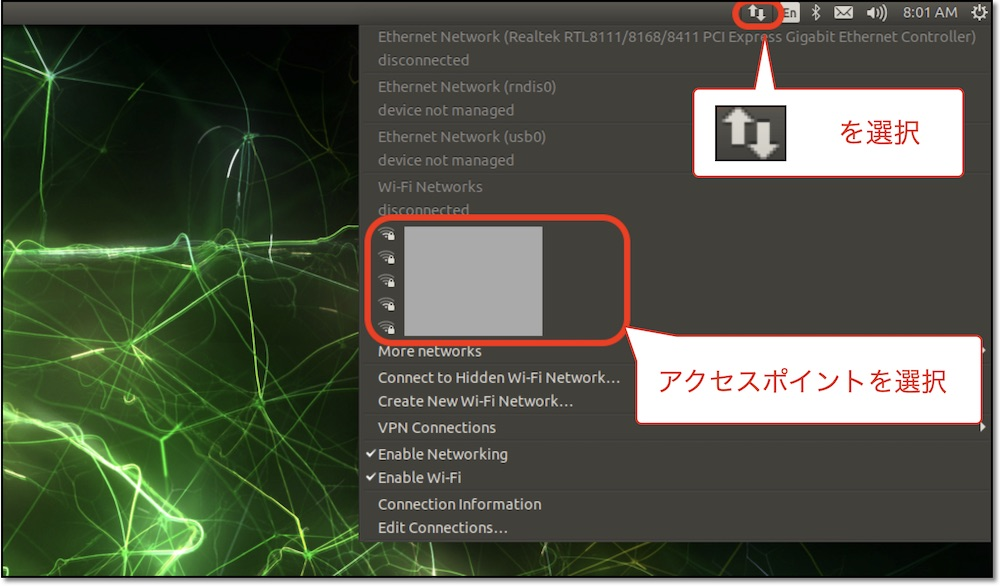

# Wi-Fiの設定

## Wi-Fiの設定(GUI)

インターネットに接続可能なWi-Fiアクセスポイントに接続します。



## Wi-Fiの設定(コマンド)

コマンド(`nmcli`)でWi-Fiを設定することもできます。ターミナルから操作します。

### アクセスポイントのスキャン

周辺のWi-Fiアクセスポイントをスキャンして、一覧を表示します。

```console
sudo nmcli device wifi rescan
nmcli device wifi list
```

SSID、電波強度(SIGNAL)、セキュリティ(SECURITY)の一覧が表示されるので、接続したいアクセスポイントのSSIDを確認します。

### SSIDとPasswordを指定して接続

SSIDとPasswordを指定して接続します。`MySSID`と`MyPassword`は、接続するアクセスポイントのSSIDとPasswordに置き換えてください。

```console
sudo nmcli device wifi connect 'MySSID' password 'MyPassword' ifname wlan0
```

### 接続の確認

接続状態を確認します。`wlan0`が`connected`になっていれば接続完了です。

```console
nmcli device status
```
