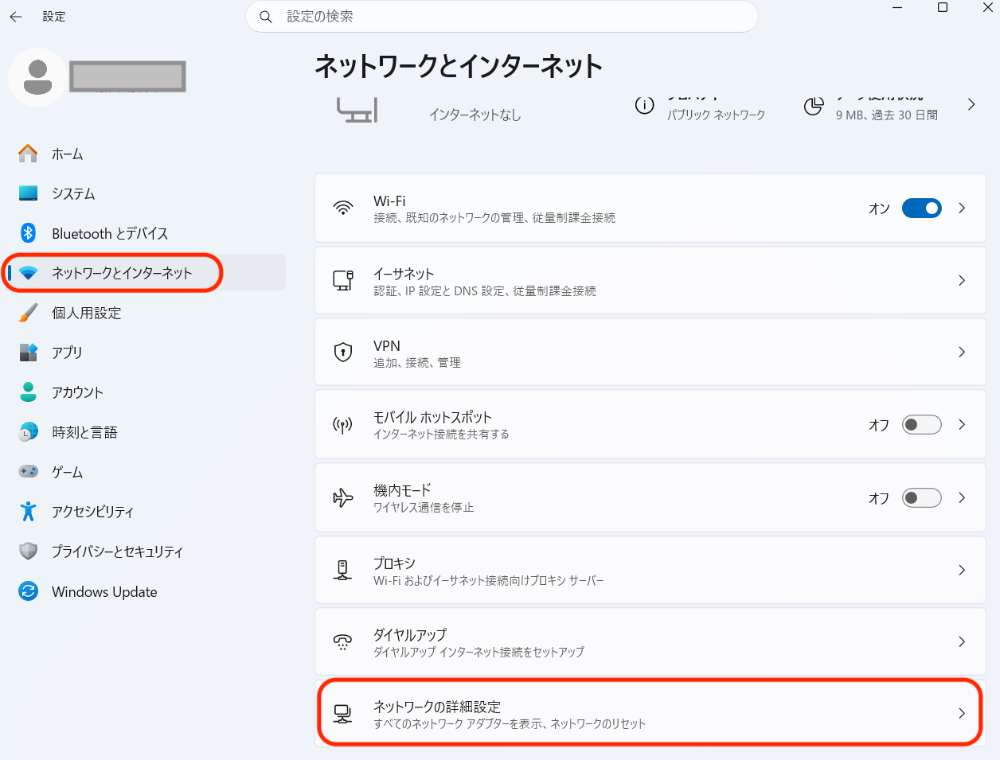
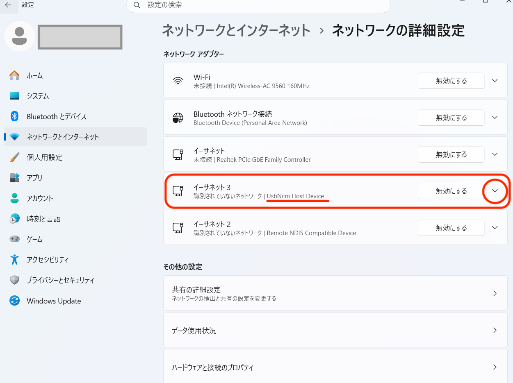
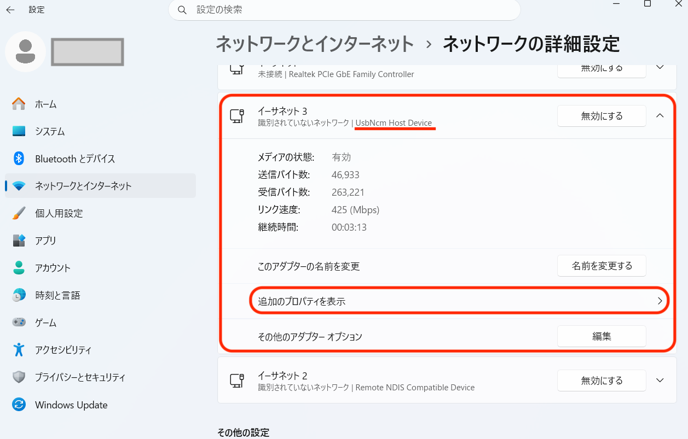
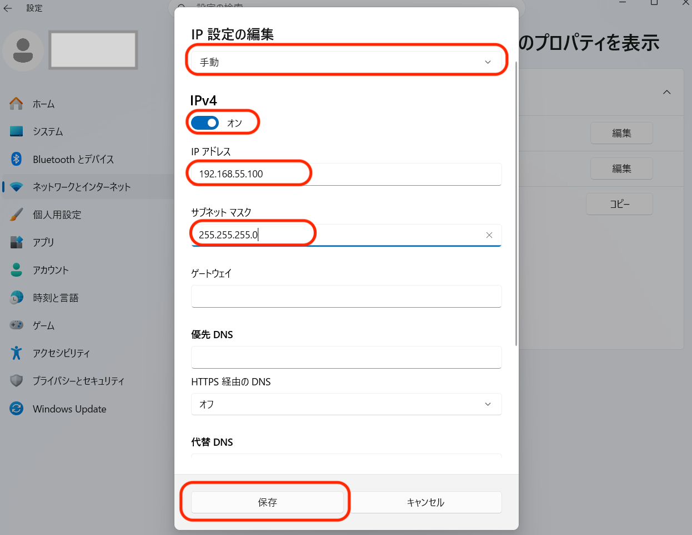
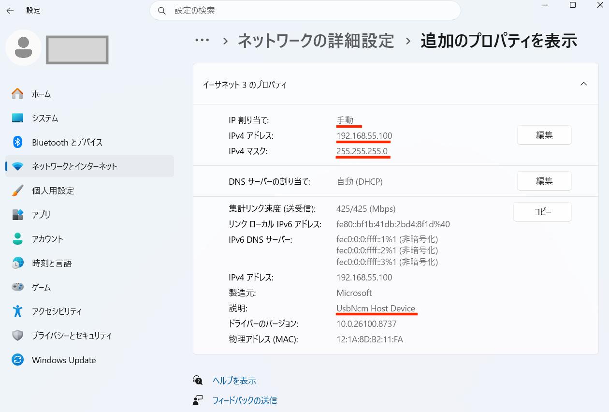

# Windowsの設定

## 問題の整理

WindowsOSでは、JetsonとWindowsを接続しても、IPアドレスが自動で割り振られないケースが多いです。そのため、手動で割り振ります。

## 設定方法

JestonとWindowsをUSB Typeで接続してください。

[Windows]-[設定]-[ネットワーク&インターネット]を選びます。

イーサネット接続の中のUsbNcm Host Deviceを探します。

手動で、IP '192.168.55.100', ネットマクス '255.255.255.0'を固定IPアドレスとして割り振ります。Jetsonには、'192.168.55.1'が割り振られているので、Windowsを'192.168.55.100'に固定すると通信が安定します。

